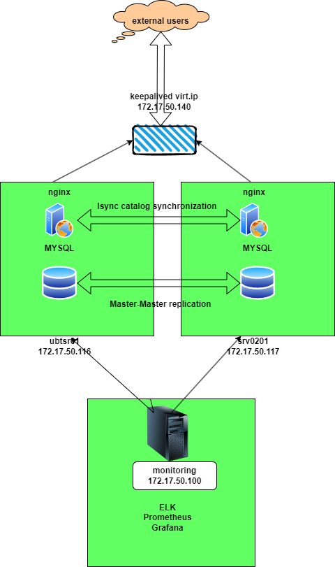

# Развертывание отказоустойчивого веб-кластера Wordpress

### Применённые в проекте технологии

* MYSQL
* lsyncd
* keepalived
* logstash
* kibana
* elastic
* Prometheus
* Nginx
* Graphana

### Характеристики стенда

* ansible 2.13.0
* VMWare Workstation 17.0.0 build-20800274
* ОС использованная на ВМ - Ubuntu 22.04.2 LTS Server
* Характеристики всех ВМ - 2vCPU, 4GB  RAM

### Схема стенда для проекта

### Описание стенда
Стенд собран из 3ех хостов, 2 из которых являются нодами кластера, на которых выполняется:
* MYSQL в режиме Master-Master, что позволяет обеспечить отказоустойчивость БД.
* Nginx, который обеспечивает работу wordpress, отказоустойчивость достигается через синхронизацию каталогов nginx c использованием lsyncd в режиме Master-Master.
* Для обеспечения непрерывности доступа к сайту wordpress по протоколу https используется виртуальный адрес 172.17.50.140, который создается за счёт использования keepalived в режиме active-backup.

3ий является сервером сбора логов(ELK стэк ) и мониторинга(Prometheus + Graphana).

### Предварительные условия для развертывания стенда:

* На машину, с которой будет производится доступ на сайт, в hosts необходимо добавить запись - 172.17.50.140	otus.tst

* На ansible host требуется установки коллекции graphana для выполения автоматического подключения дашборда 
  с визуализацией данных prometheus, выполняется командой "ansible-galaxy collection install community.grafana"

* В папку проекта E:\Diploma with ELK 21.08.2023\DipTrain (Final with some vars)\roles\elk-basic\files, 
  после его установки, необходимо файлы из  архива "https://disk.yandex.ru/d/ZFjUxFEyk0pVrA",
  данные файлы являются deb-пакетами для установки ELK, т.к. доступ к онлайн установке без использования VPN затруднён. 

### Роли в проекте и их функиции

* mysql-install - установка MYSQL на обе ноды кластера
* mysql-first - настройка репликации MYSQL на первой ноде
* mysql-second - настройка репликации MYSQL на второй ноде
* mysql-first-again - донастройка master-master репликации на первой ноде
* nginx - создание самоподписных сертификатов, установка и настройка ngix и php на нодах кластера
* lsyncd - генерация ssh-ключей, добавление fingerprints, установка lsyncd на обе ноды кластера
* wordpress - установка wordpress и создание БД для wordpress на первой ноде кластера
* keepalived - установка keepalived и добавление скрипта на запуск lsyncd по условию на обе ноды кластера
* ufw-install - добавление описания служб для ufw, запуск ufw c разрешенными службами на обе ноды кластера
* prom-basic  - Установка Prometheus, создание и запуск службы prometheus на сервер мониторига и сбора логов
* elk-basic  - Установка ELK из локальных файлов на сервер мониторига и сбора логов
* elk-config   - настройка ELK (необходимы интеракивные действия по запросам ansible) на сервер мониторига и сбора логов
* filebeat-install - установка и настройка доставщика сообщений filebeat на обе ноды кластера
* backup - настройка резервного копирования по рассписанию, на данный момент только на первой ноде.
* prom-exporters/node - установка node exporter для отображения метрик
* grafana  - установка grafana  и настройка дашборда для prometheus

### Запуск проекта

После выполнения предварительных требований запускаем "ansible-playbook -i hosts.yml playbook.yml --ask-vault-pass" пароль - 12345678

#### Ссылки сервисов, создаваемых в проекте
* https://otus.tst/ - Разворачиваемый сайт
* http://172.17.50.100:5601/ - Интерфейс для ELK. Логин elastic, пароль генерируется и отображается  при выполнении плейбука развертывания стенда,
  продемонстрировано в прилагаемом видео развертывания.
* http://172.17.50.100:9090/ - интерфейс prometheus, проверка что ноды подключены
* http://172.17.50.100:3000/ - итерфейс графана, логин/пароль - admin/admin 

#### Проверки выполненные в видео
* генерация сертификатов для сайта
* наличие сбора логов и мониторинга (ELK+Prometheus+Grafana)
* выполнение бекапа каталога сайта и БД
* синхронизация каталога сайта между нодами кластера
  синхронизация каталога сайта между нодами кластера после жесткого отключения одной из нод
* репликация БД между нодами 
* настроенный файрволл
* переключение виртуального ip для доступа к сайта при выключении ноды/остановке сервиса

